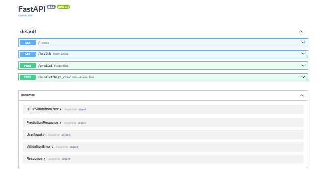
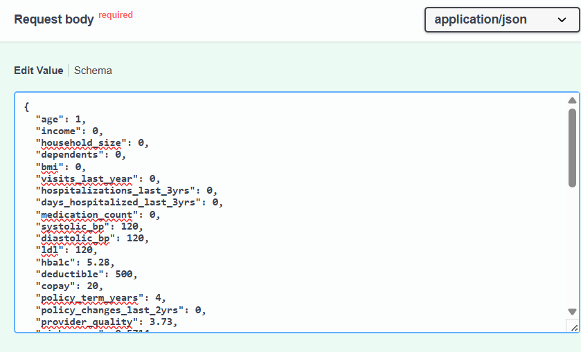
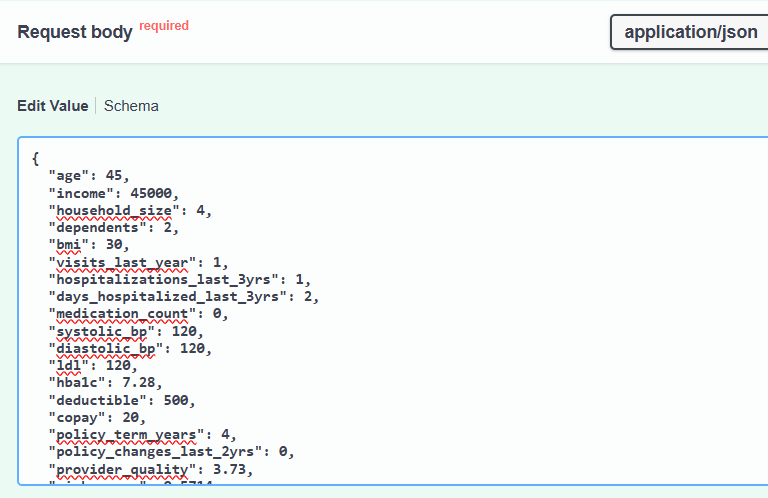

# 🏥 Medical Insurance Risk Prediction API  
Built with **FastAPI + Machine Learning + Docker**

This project provides a production-ready **REST API** that predicts whether a user falls into **High Risk or Low Risk** category for medical insurance risk.  
It uses a trained Logistic Regression model and exposes prediction endpoints via **FastAPI**, making it easy for developers and applications to consume.

---

## 🚀 Features
- ⚡ FastAPI-powered REST API (automatic docs with Swagger & ReDoc)
- 🤖 Machine Learning powered predictions
- 🎯 Two Prediction Modes  
  - `/predict` → Default threshold  
  - `/predict/high_risk` → Uses a stricter threshold (0.30) to detect high risk early  
- 🟢 `/health` endpoint to verify API is running
- 🐳 Docker-ready for easy deployment
- ☁️ Can be deployed to **AWS EC2 / Render / Railway**
- 🎨 (Upcoming) Streamlit UI frontend

---

## 📸 Screenshots

#### 🔹 Swagger UI Overview


### 🔹 Default Prediction

| Request | Response |
|--------|---------|
|  |  |


### 🔹 High Risk Prediction (Threshold 0.30)

| Request | Response |
|--------|---------|
|  |  |


## 🧠 How Risk Prediction Works
The model predicts **probability of high risk**.  
Then based on probability and threshold:

| Endpoint | Threshold Used | Output |
|--------|----------------|--------|
| `/predict` | Default model threshold | High Risk / Low Risk |
| `/predict/high_risk` | `0.30` | More sensitive to detect high-risk early |

Example response:
```json
{
  "predicted_category": "Low Risk",
  "probability_high_risk": 0.1396,
  "threshold_used": 0.3
}
```

## 📦 Project Structure

```
.
insurance_risk_prediction
│── app.py                 # FastAPI main app
│── requirements.txt
│── Dockerfile
│── README.md
|__ .dockerignore
│__ images
|
│── model/
│     ├── insurance_risk_pipeline.pkl
│     ├── predict.py
│
│── schema/
│     ├── user_input_pydantic.py
│     ├── prediction.py
```
## ▶️ Run Locally
### 1️ Clone Repo

### 2️ Install Dependencies

pip install -r requirements.txt

### 3️ Run FastAPI App

uvicorn main:app --reload

### 4️ Open in Browser

Swagger Docs:

http://127.0.0.1:8000/docs

## 🐳 Docker Hub

You can directly pull and run the API image from Docker Hub:

🔗 Docker Hub Repository:
https://hub.docker.com/r/dataforai/insurance-risk-api

## 🐳 Run with Docker

### Pull Image
docker pull <dataforai>/insurance-risk-api:latest

### Run Container
docker run -p 8000:8000 <dataforai>/insurance-risk-api:latest

### 🌍 Deployment

This project is fully **deployment-ready** and can be hosted on:
- AWS EC2    
- Render
- Railway
- Azure App Service
- Google Cloud Run
- Once hosted, it becomes publicly accessible without users needing Docker

## 📮 API Endpoints
| Method | Endpoint             | Description             |
| ------ | -------------------- | ----------------------- |
| GET    | `/`                  | Welcome                 |
| GET    | `/health`            | Health Check            |
| POST   | `/predict`           | Default Risk Prediction |
| POST   | `/predict/high_risk` | Threshold = 0.30        |

## 🛠️ Tech Stack

- Python
- FastAPI
- Logistic Regression (Sklearn)
- Docker
- Uvicorn

### ✨ Future Enhancements

- 🚀 Deploy on AWS EC2  (Learning)
- 🎨 Streamlit Web UI
